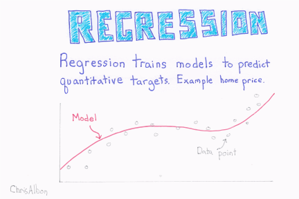
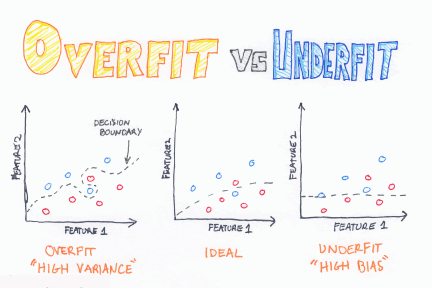
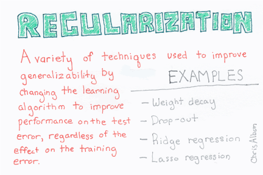
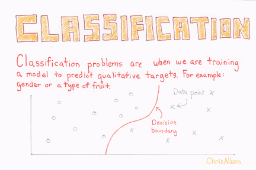
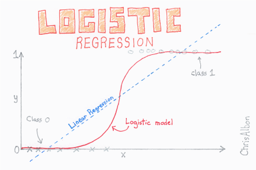
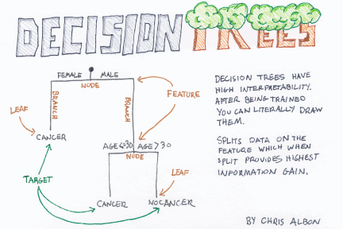
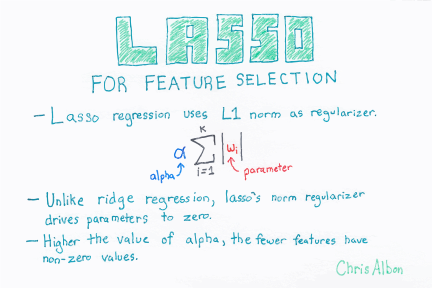

```{r setup}
do_glm<-!file.exists("glms.rds")
do_glmnets<-!file.exists("glmnets.rds")
do_trees<-!file.exists("trees.rds")
do_automl<-!file.exists("autotml.rds")
```

Once you have prepared training data you can then build models. The [Algorithm Cheat Sheet](https://docs.microsoft.com/en-us/azure/machine-learning/studio/algorithm-cheat-sheet) can be a good place to help you pick out some model types that work for your situation.

## Model types

### Regression

Regression provides a prediction of a value based on many input values. It typically uses a linear combination of values to achieve this for continuous variables. Different types of regression work on differently distributed outcomes data.



When you have a lot of parameters, but not enough data points, regression can overfit. For example, you might find regression proposing a model on the basis that there is a 100 percent probability that all patients who smoke will die, and a 100 percent probability that non-smokers will live. In reality, life does not work like that, and our models should be able to cope with finer differentiations.


Regularization aims to reduce overfitting of a model by adding a complexity penalty. If the model fits the data too closely, it is unlikely to cope with new data. Regularization penalizes hypothesis complexity in a model.



### Classification
Classification is the process of placing individual items into categories.


Classification can be split into three groups:

- **Two-class** classification has two categories. A customer is either likely to buy a product or they are not likely to buy a product.
- **Multiclass** classification has many categories. An animal could be a mammal, an insect, a bird, a reptile, or a fish (there are many other categories).
- **Multilabel** classification has manyc ategories and observations can have one or more labels. A blog post could have many tags for instance.

### Anomaly detection
Anomaly detection is useful if you are trying to find unusual data. For example, a fraud is an unusual transaction. By their very nature, these events are unusual and it can therefore be problematic to train a model because there would be very few anomalies in the data.

# BOU Models

## Basic glm
A `glm` is a generalised linear model. This allows us to build regression models against a range of outcome distributions, including **binomial** distributions.




You can either know which columns you want to include in your model, or you can perform **step-wise** select (not recommended), or you can regularize features. Here we'll include some columns.

```{r  eval=do_glm, echo=TRUE}
library(broom)
library(ggplot2)
train_sets %>% 
  map(~glm(purchased~  member_rating+ First.Responder.Kit+ None.selected.to.receive+ Monday.Links...our.favorite.SQL...tech.news.from.the.week+ weekday_open_prop + never_opened, 
           data=.,
           family="binomial",
           y=FALSE,x=FALSE,model=FALSE))  ->
  basic_glm

saveRDS(basic_glm, "glms.rds")
```

```{r eval=!do_glm, echo=FALSE}
basic_glm<-read_rds("glms.rds")
```

```{r fig.width=10}
basic_glm %>% 
  map_df(tidy, .id = "set") %>% 
  filter(term!="(Intercept)") %>% 
  ggplot(aes(x=term, y=estimate, colour=set)) +
  geom_point(alpha=.5, size=3)  +
  coord_flip() +
  ggthemes::theme_fivethirtyeight()+
  geom_hline(aes(yintercept=0), colour="darkgrey", linetype="dashed")
```

Attributes with values consistently above 0 (dashed line) increase likelihood to buy training, and those below reduce the likelihood. The further away from the 0, the greater the impact. 

```{r}
library(optiRum)
vals_to_conv<-seq(-1.5,1,by=0.5)
data_frame(Coefficient=vals_to_conv,
           `Odds Ratio (p/p-1)`= round(logit.odd(vals_to_conv),2),
           `Probability` = round(logit.prob(vals_to_conv),2))
```

## Basic tree models
Trees are widely used in computer science to represent hierarchical data. In machine learning, many algorithms use a type of tree called a decision tree to carry out classification or regression tasks by organizing rules into a hierarchy.

A decision tree starts with a root node, and then proceeds to the decision nodes and ultimately to the leaf (terminal) nodes where the decision rules are made. All nodes, except the terminal node, represent one variable and the branches represent the different categories (values) of that variable. The terminal node represents the final decision or value for that route.

Several variants on simple decision tree algorithms are available in Machine Learning, including:

- Decision forests. These incorporate regression, two-class, and multiclass algorithms.
- Decision jungles. These incorporate two-class and multiclass algorithms.
- Boosted decision trees. These incorporate regression and two-class algorithms.
Although the details of implementation vary, these methods are all used to subdivide a feature space into regions of similarity.



```{r eval=do_trees, echo=TRUE}
library(FFTrees)
train_sets %>% 
  map(~mutate(.,purchased=unclass(purchased)-1)) %>% 
  map(~FFTrees(purchased~., .,
               goal="bacc",do.comp = FALSE,progress = FALSE)) ->
  basic_trees
saveRDS(basic_trees, "trees.rds")
```

```{r eval=!do_glm, echo=FALSE}
basic_trees<-read_rds("trees.rds")
```

```{r}
basic_trees %>% 
  map_df(~cbind(.$tree.definitions,.$tree.stats$train),.id = "set") ->
  basic_tree_results

basic_tree_results
```


The chart shows different trees built using the different data sets and the balanced accuracy measure. Balanced accuracy is average of the proportion of purchases correctly classified and the proportion of non-purchases correctly classified.
```{r fig.width=10}
basic_tree_results %>% 
  ggplot(aes(x=cues, y=bacc, colour=set)) +
  geom_point(alpha=.5, size=3)  +
  coord_flip() +
  ggthemes::theme_fivethirtyeight()
```

We can look at the difference between the correctly classified purchases (red) and the correctly classified non-purchases (grey) for the trees with the highest balanced accuracy. There's two visible cases:

1. high accuracy for purchases and low accuracy for non-purchases 
2. OK accuracy for purchases and good accuracy for non-purchases

Selection one of these would depend on the cost of the low accuracy for non-purchases.

```{r fig.width=10}
basic_tree_results %>% 
  top_n(10, bacc) %>% 
  mutate(cues=stringr::str_wrap(stringr::str_replace_all(cues,";", " "),1)) %>% 
  dplyr::select(cues, sens, spec, set) %>% 
  ggplot(aes(x=set, y=spec, ymax=sens, ymin=spec)) +
  geom_pointrange(alpha=0.3, size=2)+
  geom_point(aes(y=sens), colour="red", size=6)+
  facet_wrap(~cues, ncol=4)+
  ggthemes::theme_fivethirtyeight()
```


## Regularized regression

glmnets take all our variables and construct a model with them. However, a model with `r ncol(test_b)-1` coefficients would be pretty crazy. Instead `glmnet` downweights coefficients towards 0 as it penalises complexity. As such, even though our model notionally contains all our columns not everything will contribute.


```{r eval=do_glmnets}
library(glmnet)
library(glmnetUtils)
train_sets %>% 
  map(~cv.glmnet(purchased~., data=. ,
              family = "binomial",type.measure="class",
              standardize = FALSE)) ->
  basic_glmnets

saveRDS(basic_glmnets, "glmnets.rds")
```

```{r eval=!do_glmnets, echo=FALSE}
basic_glmnets<-read_rds("glmnets.rds")
```

```{r fig.height=15}
basic_glmnets %>% 
  map_df(~rownames_to_column(as.data.frame(as.matrix(coefficients(.))),"col"),.id = "set" ) %>% 
  rename(coef=`1`) -> 
  basic_glmnet_coefs

basic_glmnet_coefs %>% 
  filter(coef!=0.000000e+00) %>% 
  filter(col!="(Intercept)") %>% 
  arrange(col) %>% 
  count(col) %>% 
  mutate( pane = row_number() %/% 38) ->
  panes
  
basic_glmnet_coefs %>% 
  inner_join(panes) %>% 
  arrange(desc(col)) %>% 
  mutate(col=fct_inorder(col)) %>% 
  ggplot(aes(x=col, y=coef, colour=set)) +
  geom_point() + 
  coord_flip()+
  facet_wrap(~pane,scales = "free", ncol=5)+
  ggthemes::theme_fivethirtyeight()
```

We can see which columns make it into our models most commonly. These will be the most predictive columns overall.
```{r fig.height=15}
panes %>% 
  arrange(desc(n)) %>% 
  mutate(col=fct_inorder(col)) %>% 
  mutate( pane = row_number() %/% 38) %>% 
  arrange(desc(col)) %>% 
  mutate(col=fct_inorder(col)) %>% 
  ggplot(aes(x=col, y=n)) +
  geom_col() + 
  coord_flip()+
  facet_wrap(~pane, ncol=5, scales = "free_y")+
  ggthemes::theme_fivethirtyeight()
```


## Complex models via h2o
There are many more complicated / sophisticated model types that can be built. [h2o.ai](https://h2o.ai) have been building aplatform that can help us build powerful models using simple code. h2o is often used to win Kaggle competitions.

```{r eval=do_automl, message=FALSE, results='hide'}
library(h2o)
options("h2o.use.data.table"=TRUE)
h2o.init(max_mem_size = "6G")
train_sets %>% 
  map(as.h2o) %>% 
  map(~h2o.automl(y = "purchased", training_frame = ., seed = 1313, max_runtime_secs = 60)) ->
  basic_automl

saveRDS(basic_automl, "automl.rds")
```

```{r eval=!do_glmnets, echo=FALSE}
basic_automl<-read_rds("automl.rds")
```

```{r}
basic_automl %>% 
  map_df(~as.data.frame(.@leaderboard), .id="set")  ->
  automl_highlevel_results

automl_highlevel_results
```
